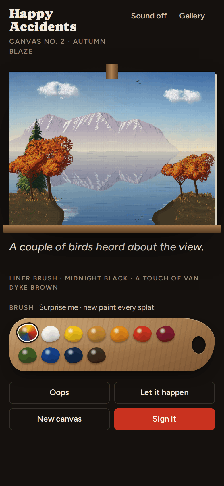
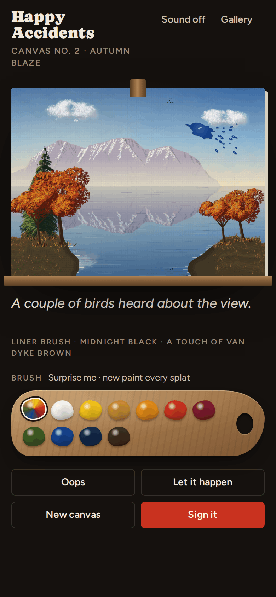
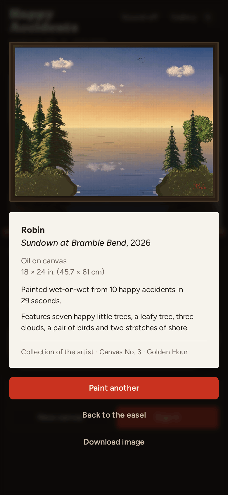
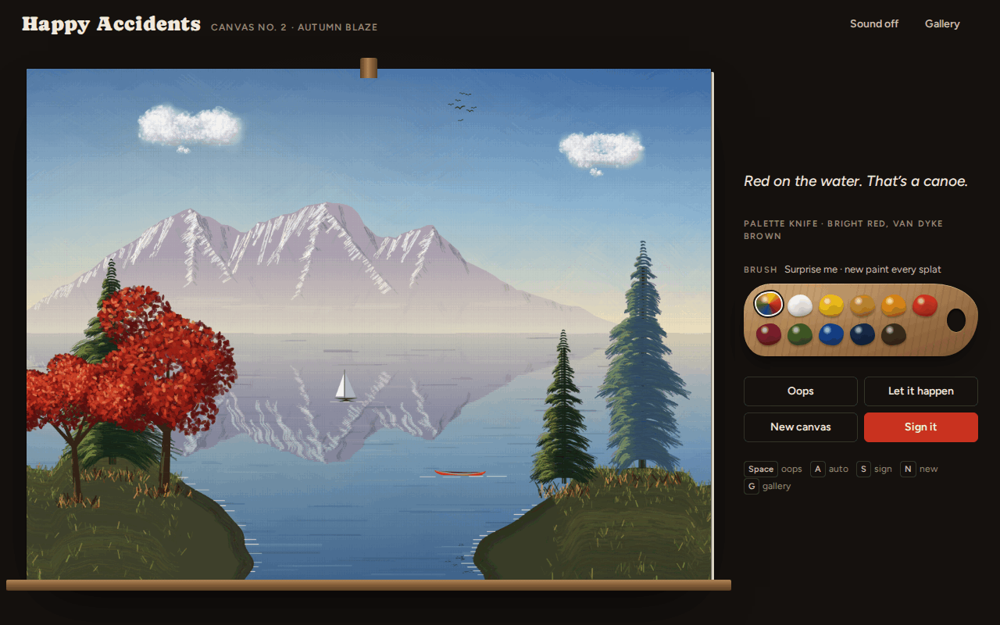

# Happy Accidents

**Play it: [happy-accidents.junkdrawer.works](https://happy-accidents.junkdrawer.works/)**

**A painting toy where you can't paint on purpose.** You flick, tap or pour paint at a canvas on an easel. After a beat, a gentle painter decides what each splat was trying to be and paints it in, stroke by stroke, in the splat's own color and shape. Paint that lands on something already there changes it. There's no undo.

<p align="center">
  
  &nbsp;
  
  &nbsp;
  
</p>

<p align="center">
  
</p>

## How it plays

- **Tap** for a small splat, **flick** (drag and let go) to fling a stretched one with droplets, or **press and hold** to let the paint pool until you let go.
- **The paint's color decides what it becomes, and where it lands decides which version** (table below). White high in the sky is a cloud; out on the lake it's a sailboat. Brown up high is a storm cloud; on land it's a cabin or a bare tree. On the horizon, any paint makes a far-off row of trees in its color, and small flecks up high are birds, stars or wisps of cloud.
- **The shape of the splat carries through.** A mountain's ridge is the top edge of the splat, blown up, so spikes become needle peaks. A cloud has the splat's silhouette, land in the lake takes its outline, and a leafy tree's crown is the splat. Every flung droplet becomes its own bird, star, flower or ripple.
- **Paint on something changes it** (second table).
- **Wet paint mixes like paint.** Two splats that touch while they're still wet run together into one bigger splat, and the mixed color decides what it becomes: yellow into blue makes green, red into yellow makes orange, white into red makes pink, red into green makes brown. Picking another paint keeps the last splat wet for a moment, so you can hit it again.
- **The palette** loads the brush. **Surprise me** picks a new paint every time.
- **Oops** (<kbd>Space</kbd>) makes an accident you didn't. **Let it happen** (<kbd>A</kbd>) keeps accidents coming on their own until the painting feels done. They use the paint you've loaded and aim it somewhere it makes sense; on Surprise me, they pick a paint that suits where they're aiming.
- **Every canvas gets a mood:** Golden Hour, Winter Hush, Northern Night, Autumn Blaze, Misty Morning or Violet Dusk. The lake reflects everything above the horizon.
- **Sign it** (<kbd>S</kbd>) to put your name on it in red. You get a museum label with a made-up title, and the painting goes up on your gallery wall (<kbd>G</kbd>).
- No account and no server. Signed paintings stay in your browser. It works offline and installs to a phone's home screen.

| Paint | High in the sky | Low in the sky | On the lake | On land |
| --- | --- | --- | --- | --- |
| White | a white cloud, the sun or moon, or stars at night | a snowy mountain or a cloud | a sailboat, or light on the water | a snowy pine or a birch |
| Yellow | the sun, then golden clouds | the sun or golden clouds | glints of light, or land from Yellow Ochre | a golden tree or bush |
| Red | a sunset cloud | a red-rock mountain or a sunset cloud | a canoe | a red tree or bush, or a red cabin |
| Green | the top of a tall pine, or an aurora at night | a wooded mountain | land, an island or a mossy rock | pines, leafy trees and bushes |
| Blue | a cool cloud, or a storm from Prussian Blue | a blue mountain or a cool cloud | ripples | a blue spruce |
| Brown | a storm cloud, or birds | a mountain | land, or a rock | a cabin, a bare tree or a bush |

Paint that lands on something already there changes it instead:

| Hit | With | And |
| --- | --- | --- |
| a tree | white | snow settles on it |
| an evergreen | yellow or red | late light catches its side |
| a leafy tree or bush | yellow or red | it turns to autumn |
| a tree | anything else | a friend grows next to it |
| a mountain | white / blue / yellow or red / green | fresh snow / a waterfall / alpenglow / trees up the slope |
| the sun or moon | warm or white | the whole sky warms into a sunset |
| the sun or moon | anything else | a cloud drifts across it |
| a cloud | something dark | it turns stormy and rains |
| the cabin | white / warm / anything | snow on the roof / the lights come on / a garden |
| a rock | green / white | moss / snow |

## Running it

It's a static site: plain HTML, CSS and JavaScript modules, with no build step.

```sh
npx serve .                   # or any static file server, then open the printed address
npm install                   # only for the tools below
npm test                      # unit tests, then paints in Chromium through the real page (needs Playwright)
node tools/screenshots.mjs    # redraws docs/*.png and og.png
node tools/make-icons.mjs     # redraws the PNG icons from icon.svg
npm run build                 # writes dist/happy-accidents.html, one file that opens from anywhere
```

Opening `index.html` straight from disk won't work, because browsers block JavaScript modules on `file://`. The built file does work that way.

To put it online with GitHub Pages: **Settings → Pages → Build and deployment → Deploy from a branch**, then pick `main` and `/ (root)`.

### Files

It's Canvas 2D with no framework and no image files: everything on the canvas is painted in code.

- `src/brush.js`: the brush engine. A stroke is many thin bristle lines, each with its own color wobble, opacity and dry-brush breaks. Knife pulls, taps and scrubs are built from it.
- `src/splat.js`: the accident itself: a glossy blob with wobble, spikes and flung droplets, and its outline in canvas coordinates (a union, when wet splats run together).
- `src/shape.js`: turns that outline into silhouettes: top edges, side profiles, clumps.
- `src/color.js`: color helpers, including how paints mix (yellow and blue make green) and which family a mixed color belongs to.
- `src/decide.js`: reads a splat and returns a plan, such as land and then a tree on it. It checks what's already painted under the splat first, pixel by pixel, and reacts to that; otherwise the paint's color and where it landed pick what it becomes.
- `src/paint/`: one painter per thing, plus `react.js` for changes to things already there. Each returns a bounding box, a depth and a list of small drawing steps played back over a second or two, so you watch it being painted.
- `src/studio.js`: the scene. Every element paints into its own layer, composited back to front by depth. The lake is a mirrored, rippled copy of everything above the horizon.
- `src/words.js`: what the painter says, the brushes and paints they name, and titles like *Cabin at Otter Cove*.
- `src/sound.js`: optional sounds, made with Web Audio from soft pink noise: the damp pat of a splat on canvas and the swish of a brush (off by default).
- `fonts/`: Caprasimo, Figtree and Mrs Saint Delafield (SIL Open Font License), served from here so nothing loads from elsewhere.
- `sw.js`: keeps a copy for painting offline. `npm test` checks that it lists every file the page needs.
- `tools/`: the screenshot and icon scripts above. `scripts/build.mjs`: the single-file build.

The studio is on `window.happyAccidents` if you want to play from the console:

```js
happyAccidents.newCanvas('northern-night')
happyAccidents.randomAccident({ hint: 'cabin' })
```
